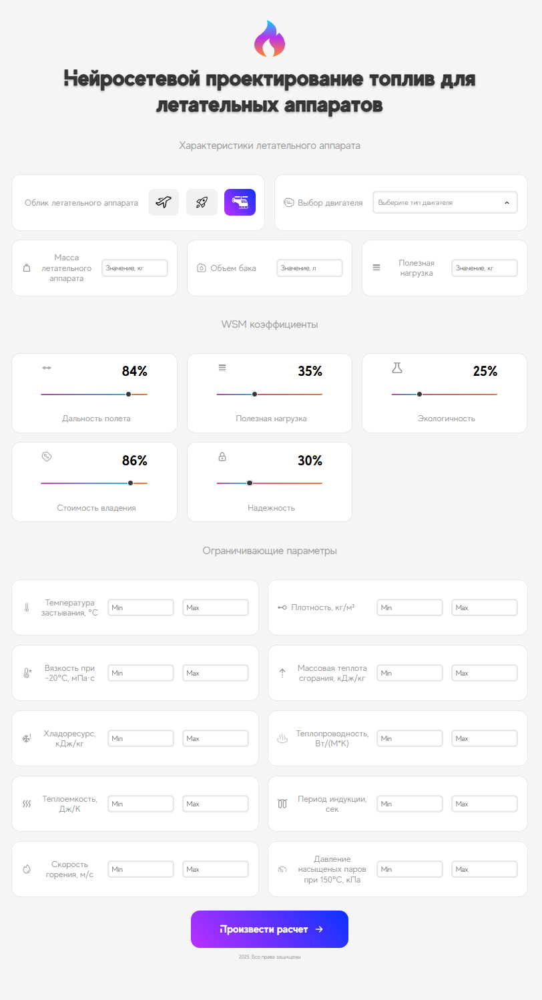
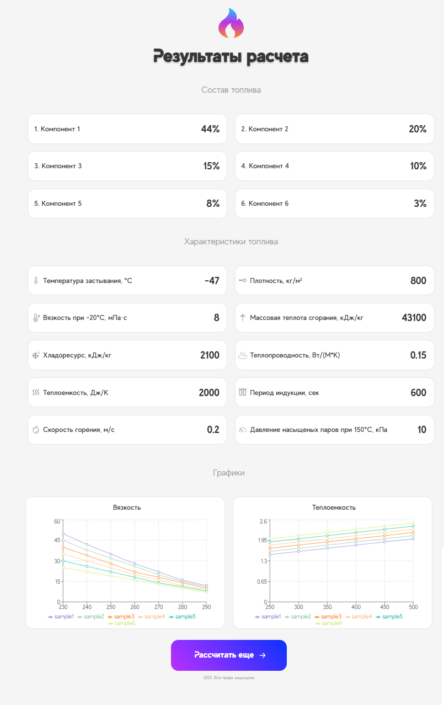

# Project: Neural Network Design of Fuel Compositions


[](https://fuel-to-do-react-4myswvw5i-alexandermolokanovvs-projects.vercel.app/)

This software was developed as part of the experimental studies conducted under the National Key R&D Program of China [2022YFE0204100] at the Harbin Institute of Technology.

This is an educational version of a web application designed for students of Harbin Institute of Technology to calculate the characteristics of fuel compositions for aerospace vehicles using neural network algorithms. The project includes a frontend (React) and a backend (Node.js with Express), enabling parameter input, calculation of fuel efficiency, flight range, and cost, as well as result visualization.

## How to Cite

!!!!!!!!!!!!!!!!!!!!!!!!!!!!!!!!!!!!!!!!!!!!!!!!!!!!!!

If you use this software in your research, please cite it as:

Molokanov, A. A., Zhou, WX, Kuzmin, M. V. (2025). Neural Network Design of Fuel Compositions (Version v1.0). GitHub Repository. Available at: https://github.com/AlexanderMolokanovv/fuel-to-do-react.

We also encourage acknowledging the funding source where appropriate:

Funding acknowledgment: This work was supported by the National Key R&D Program of China under Grant No. 2022YFE0204100, conducted at the Harbin Institute of Technology.

如果您在研究中使用此软件，请按以下方式引用：

Molokanov, A. A., Zhou, WX, Kuzmin, M. V. (2025). Neural Network Design of Fuel Compositions（版本 v1.0）。GitHub 存储库。访问地址：https://github.com/AlexanderMolokanovv/fuel-to-do-react。

我们鼓励在适当情况下声明资助来源：

资助声明：本研究得到中国国家重点研发计划（2022YFE0204100号）资助，由哈尔滨工业大学开展。

## Table of Contents

- [Links](#links)
- [Description](#description)
- [Project Structure](#project-structure)
- [Technologies](#technologies)
- [Installation and Setup](#installation-and-setup)
- [Available Scripts](#available-scripts)
- [Testing](#testing)
- [Deployment](#deployment)
- [Usage Examples](#usage-examples)
- [Troubleshooting](#troubleshooting)
- [Contributing](#contributing)
- [Additional Information](#additional-information)
- [Future Plans](#future-plans)
- [Contact](#contact)
- [License](#license)

## Links

- **Current Deployment**: [Vercel](https://fuel-to-do-react-4myswvw5i-alexandermolokanovvs-projects.vercel.app/)
- **Repository**: [GitHub](https://github.com/AlexanderMolokanovv/fuel-to-do-react)
- **Server IP Address**: `158.160.55.39` (for future deployment)

## Description

The application allows users to:
- Select the type of aerospace vehicle (airplane, rocket, helicopter) and engine.
- Input parameters such as vehicle mass, fuel tank volume, payload, and WSM coefficients.
- Set limiting parameters (e.g., freezing point, density, viscosity, etc.).
- Send data to the server for fuel characteristic calculations.
- View results, including fuel efficiency, flight range, cost, and graphs showing viscosity and heat capacity dependencies on temperature.

 


## Project Structure

### Main Directories
- `/src` — Frontend (React components, styles, API requests).
- `/server` — Backend (Node.js/Express API, routes, controllers, calculation utilities).
- `/src/components` — React components (App.jsx, Header.jsx, InputComponent.jsx, SliderComponent.jsx, ResultsPage.jsx, etc.).
- `/src/blocks` — CSS styles for components (BEM methodology).
- `/server/routes` — API routes (calculateRoutes.js).
- `/server/controllers` — Controllers (calculateController.js).
- `/server/utils` — Calculation utilities (calculations.js).
- `/server/tests` — API tests (calculate.test.js).

### Main Routes
- `/` — Main page for entering aerospace vehicle parameters.
- `/results` — Results page displaying calculations (efficiency, range, cost, fuel composition, graphs).

## Technologies

- **Frontend**: React (18.x), React Router (6.x), Axios, Recharts (for charts), Jest (for testing).
- **Backend**: Node.js (18.x), Express (4.x), Winston (logging), Supertest (for API testing).
- **Styles**: CSS with BEM methodology, custom fonts (MADE, MADE-EVO), Normalize.css.
- **Tools**: Create React App, Git, Vercel (for deployment).

**System Requirements**:
- Node.js: >= 18.x
- npm: >= 8.x
- Browser: Modern versions of Chrome, Firefox, Safari.

## Installation and Setup

1. **Clone the Repository**:
   ```bash
   git clone https://github.com/AlexanderMolokanovv/fuel-to-do-react.git
   cd fuel-to-do-react
   ```

2. **Install Frontend Dependencies**:
   ```bash
   npm install
   ```

3. **Install Backend Dependencies** (in the `/server` directory):
   ```bash
   cd server
   npm install
   ```

4. **Set Up Environment Variables**:
   - Create a `.env` file in the `/server` directory:
     ```env
     PORT=3001
     ```
   - For the frontend, if needed, set `REACT_APP_API_URL` in a `.env` file in the project root:
     ```env
     REACT_APP_API_URL=http://localhost:3001
     ```

5. **Start the Frontend**:
   ```bash
   npm start
   ```
   The application will be available at [http://localhost:3000](http://localhost:3000).

6. **Start the Backend**:
   ```bash
   cd server
   node server.js
   ```
   The API will be available at [http://localhost:3001](http://localhost:3001).

7. **Dump Source Code to Text Files** (if needed):
   ```bash
   chmod +x dump-src.sh dump-serv.sh
   npm run dump-src
   npm run dump-serv
   ```
   The `dump-src.sh` and `dump-serv.sh` scripts collect frontend and backend source code into text files.

## Available Scripts

In the project directory, the following commands are available:

- `npm start` — Starts the frontend in development mode ([http://localhost:3000](http://localhost:3000)).
- `npm test` — Runs frontend tests in interactive mode.
- `npm run build` — Builds the frontend for production in the `build` directory.
- `npm run eject` — Ejects Create React App configuration for full customization (irreversible).

## Testing

- **Frontend**: Tests are written using Jest and React Testing Library (see `App.test.js`).
- **Backend**: API tests are written using Supertest (see `calculate.test.js`).
  Run tests with:
  ```bash
  npm test
  ```

## Deployment

The current deployment is hosted on Vercel: [fuel-to-do-react-4myswvw5i-alexandermolokanovvs-projects.vercel.app](https://fuel-to-do-react-4myswvw5i-alexandermolokanovvs-projects.vercel.app/).  
Future deployment is planned on a server with IP `158.160.55.39` or other platforms.

To deploy on Vercel:
1. Install Vercel CLI:
   ```bash
   npm install -g vercel
   ```
2. Deploy the project:
   ```bash
   vercel
   ```

## Troubleshooting

- **CORS Error**: Ensure the server is configured with `cors` (`app.use(cors())`) and `REACT_APP_API_URL` points to the correct API address.
- **Dependency Error**: If `npm install` fails, delete `node_modules` and `package-lock.json`, then run `npm install` again.
- **Server Not Starting**: Check if port `3001` is free (`lsof -i :3001` on Linux/Mac) and verify the `.env` file contains `PORT=3001`.

## Contributing

We welcome contributions to the project! To contribute:
1. Fork the repository.
2. Create a branch for your changes: `git checkout -b feature/change-description`.
3. Follow the code style (ESLint, Prettier).
4. Create a pull request with a description of the changes.
5. Ensure tests pass: `npm test`.

Details will be added in [CONTRIBUTING.md](CONTRIBUTING.md) (coming soon).

## Additional Information

- **Create React App Documentation**: [https://create-react-app.dev/](https://create-react-app.dev/)
- **React Documentation**: [https://reactjs.org/](https://reactjs.org/)
- **Deployment Documentation**: [https://create-react-app.dev/docs/deployment/](https://create-react-app.dev/docs/deployment/)
- **Performance Optimization**: [https://create-react-app.dev/docs/analyzing-the-bundle-size/](https://create-react-app.dev/docs/analyzing-the-bundle-size/)

## Future Plans

- Implement a full neural network model for fuel composition calculations.
- Add new parameters and characteristics for more accurate calculations.
- Integrate with additional APIs for data analysis.
- Improve UI/UX based on user feedback.
- Transition to a new server for deployment.

## Contact

- **GitHub Issues**: [Create an Issue](https://github.com/AlexanderMolokanovv/fuel-to-do-react/issues)
- **Email**: [20230291@hit.edu.cn](mailto:20230291@hit.edu.cn)
- **Discord**: To be added soon.

## License

This project is licensed under the MIT License. See the [LICENSE](LICENSE) file for details.